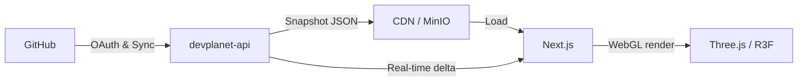

# thedev.world front

WebGL client and UI for [thedev.world](https://thedev.world/), an interactive 3D social experience built around GitHub contributions.

> **Live:** [thedev.world](https://thedev.world/)


## Table of contents

- [Description](#description)
- [Getting started](#getting-started)
- [Tech stack](#tech-stack)
- [Architecture](#architecture)
- [Configuration](#configuration)
- [Code quality & testing](#code-quality--testing)
- [Contributing](#contributing)
- [License](#license)

## Description

[thedev.world](https://thedev.world/) lets developers visualize their GitHub activity on a 3D planet.
The world is split into thematic islands based on technical specialties (frontend, backend, infra, etc.).
Each developer's public activity (commits, pull requests, reviews, stars) determines the size and level of their territory on their chosen island.

This front communicates with the [thedevworld-api](https://github.com/thedev-world/api) FastAPI backend to fetch geographic data and scores.

## Getting started

### Prerequisites

- Node.js v20+
- npm 10+
- A local instance of [thedevworld-api](https://github.com/thedev-world/api) running on port `8000`

> Local development requires the backend to be running. Check out the [thedevworld-api](https://github.com/thedev-world/api) README for setup instructions.

### Installation

1. Install dependencies:
   ```bash
   npm install
   ```

2. Set up environment variables:
   ```bash
   cp .env.local.example .env.local
   ```
   Then edit `.env.local` to match your environment (see [Configuration](#configuration)).

3. Start the development server:
   ```bash
   npm run dev
   ```

The app is available at http://localhost:3000.

## Tech stack

- **Language**: TypeScript 5
- **Framework**: Next.js 16 (App Router)
- **3D / WebGL**: React Three Fiber, @react-three/drei, Three.js
- **State management**: Zustand
- **Styles & UI**: Tailwind CSS v4, shadcn/ui
- **Data fetching**: TanStack Query v5
- **Testing**: Vitest

The app uses Next.js `standalone` export mode for optimal performance and minimal production footprint.

## Architecture



### Project structure

The project follows a feature-based architecture, application logic is organized by domain under `src/features/`. Each module encapsulates its own components, hooks, stores, types, and API calls.

```text
thedevworld-front/
├── .github/          # GitHub Actions CI/CD workflows
├── .husky/           # Git pre-commit hooks (linting)
├── public/           # Static assets and 3D textures
├── scripts/          # Automation scripts
└── src/
    ├── app/          # Routes, pages and layouts (Next.js App Router)
    ├── components/   # Shared cross-cutting components (shadcn atomic UI)
    ├── config/       # Global constants and settings
    ├── features/     # Feature modules organized by domain
    │   ├── auth/     # GitHub OAuth authentication
    │   ├── capture/  # 3D territory snapshot and screenshot
    │   ├── developer/# Developer business data
    │   ├── planet/   # Core 3D logic (globe, hexagonal cells)
    │   └── ...       # Each feature contains: api/, components/, hooks/, stores/, types/
    ├── hooks/        # Shared global React hooks
    ├── lib/          # Cross-cutting client initialization (API, QueryClient…)
    ├── stores/       # Global Zustand stores
    ├── types/        # Global TypeScript types
    └── utils/        # Pure utility functions
```

## Configuration

All environment variables are documented in `.env.local.example`.

| Variable | Description | Example |
|---|---|---|
| `NEXT_PUBLIC_API_URL` | Public API URL (client-side) | `http://localhost:3000/api` |
| `NEXT_PUBLIC_SITE_URL` | Public site URL (OG images, SEO) | `http://localhost:3000` |
| `NEXT_PUBLIC_PLANET_JSON_URL` | Path to the planet JSON snapshot | `/snapshots/devplanet/planet-data.json` |
| `BACKEND_URL` | FastAPI backend URL (server-side only) | `http://127.0.0.1:8000` |
| `PLANET_CAPTURE_BASE_URL` | MinIO URL for OG/SSR rendering | `http://127.0.0.1:9000/devplanet` |

### Local OAuth (`npm run dev`)

The GitHub OAuth callback must go through Next.js on `:3000` (same-origin cookies):

- GitHub OAuth App → **Authorization callback URL**: `http://localhost:3000/api/v1/auth/github/callback`
- API `.env` → `OAUTH_CALLBACK_URL`: same value
- Front `.env.local` → `BACKEND_URL=http://127.0.0.1:8000`

## Code quality & testing

- **Linting**: ESLint
  ```bash
  npm run lint        # Check
  npm run lint:fix    # Auto-fix
  ```
- **Testing**: Vitest
  ```bash
  npm run test        # Run in CI mode
  npm run test:watch  # Interactive watch mode
  ```
- **Build**:
  ```bash
  npm run build
  ```
- **Git hooks**: Husky + lint-staged block commits when the linter reports errors on staged files.

## Contributing

Contributions are welcome. Please follow these conventions to keep the history clean and reviews smooth.

### Branch naming

- `feat/feature-name` — new feature (e.g. `feat/interactive-cells`)
- `fix/bug-name` — bug fix
- `refactor/refactor-name` — code restructuring with no functional changes
- `chore/topic` — maintenance tasks, config updates, dependency bumps

### Commit conventions

This project follows the [Conventional Commits](https://www.conventionalcommits.org/) specification. All commit messages must be written **in English**:

```
type(scope): description
```

Examples:
- `feat(planet): add visual indicators for hovered cells`
- `fix(auth): handle expired github credentials on sync`
- `chore(deps): update three.js dependencies`

### Process

1. Fork the repository.
2. Create your branch (`git checkout -b feat/my-feature`).
3. Make your changes.
4. Make sure linting and tests pass (`npm run lint` and `npm run test`).
5. Commit and push to your fork.
6. Open a detailed Pull Request.

To report a bug or request a feature, open an [Issue](https://github.com/thedev-world/devplanet-front/issues).

## License

This project is licensed under the MIT License. See the [LICENSE](LICENSE) file for details.
